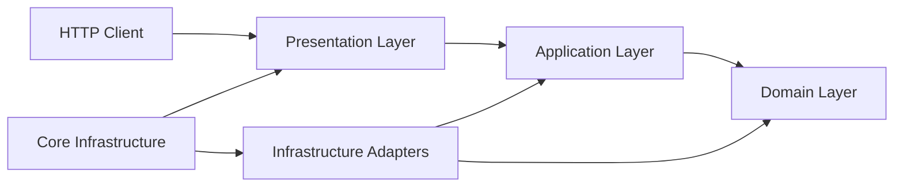

# Harbor API Kit

Enterprise-grade API starter built with NestJS (Fastify adapter). Follows Clean Architecture with strict layer boundaries, centralized configuration, and a security-first design (sessions, CSRF, rate limiting, RBAC, file storage, i18n).

## Who This Is For

- Teams building a production-oriented NestJS API starter with strong module boundaries.
- Developers who want cookie-based auth, RBAC, Prisma, Redis, i18n, file storage, and contract tests wired together.
- Projects that value explicit architecture and guardrails over a minimal blank template.

## Who This Is Not For

- Tiny prototypes that need a single-file API.
- Projects that want JWT bearer-token auth as the default.
- Teams that do not want Clean Architecture boundaries enforced by lint rules.

## Tech Stack

| Category      | Technology                                            |
| ------------- | ----------------------------------------------------- |
| Runtime       | Node.js 22, TypeScript 5.9, NestJS 11, Fastify 5      |
| Database      | PostgreSQL (via Prisma 7)                             |
| Cache / Queue | Redis (ioredis), BullMQ                               |
| Auth          | better-auth (sessions, OAuth: Google/GitHub)          |
| Validation    | Zod v4 (strict DTOs)                                  |
| i18n          | nestjs-i18n (ar-SY, en-US)                            |
| Logging       | Pino (structured, request-scoped context)             |
| Email         | Resend (via BullMQ async queue)                       |
| File Storage  | S3-compatible, Google Cloud Storage, Local filesystem |
| API Docs      | Swagger (OpenAPI) + Scalar UI                         |
| Testing       | Jest + Supertest (unit, contract, e2e)                |
| CI            | GitHub Actions                                        |

## Implemented Features

- **Authentication** - Cookie-based sessions via better-auth, OAuth (Google, GitHub), email/password with optional verification emails, session management (list/revoke/logout-all), geolocation tracking (IP, city, country)
- **RBAC** - Role-based access control with permission inheritance. Roles, permissions, user-level grants (ALLOW/DENY), effective permissions computation with Redis caching (L1 request-scoped + L2 Redis)
- **Users** - Full CRUD, profile management, role/permission assignment, soft deletes
- **File Storage** - Multi-driver upload (S3/R2/Spaces, GCS, Local), magic bytes validation, presigned download URLs, public/private visibility toggle, public token-based access
- **Notifications** - Async email delivery via BullMQ + Resend, retry with exponential backoff, HTML email templates
- **Security** - CSRF double-submit cookies, rate limiting (global + per-route, IP/user/session strategies), application-level security headers, input validation (Zod strict mode), origin/referer allowlists
- **i18n** - Full internationalization (Arabic ar-SY default, English en-US), locale negotiation via header/query, translated error messages and email templates
- **API Documentation** - Auto-generated OpenAPI/Swagger at `/documentation` (Scalar UI), CSRF token injection for interactive testing
- **Health** - `GET /health` with database + Redis connectivity checks
- **Observability** - Pino structured logging with request ID, user ID, locale context injection

## Roadmap

Planned features live in [ROADMAP.md](ROADMAP.md). The README lists implemented behavior only.

## Known Limitations

- Email verification emails are sent, but verification enforcement is optional by default.
- The included production Docker Compose setup is a reference single-host deployment, not a full orchestration platform.
- The `shared` module is reserved for cross-feature provider wiring and currently only hosts shared cache binding.
- Security audit findings are triaged through Dependabot, CodeQL, and the advisory CI audit step; reachable production vulnerabilities should be fixed before release.

## Architecture

This project follows **Clean Architecture** with strict layer boundaries enforced via ESLint.

See [ARCHITECTURE.md](ARCHITECTURE.md) for the full architectural rules (single source of truth).

### Layer Structure

Each feature module follows this structure:

```
modules/<feature>/
  domain/          # Pure business logic (no framework deps)
  application/     # Use-cases + orchestration
  infrastructure/  # Adapters (Prisma, external providers)
  presentation/    # Controllers, DTOs, guards
```

Cross-cutting concerns live in `core/`:

```
core/
  domain/          # Shared exceptions, types, ports
  application/     # Cache service, logger port
  infrastructure/  # Config, Prisma, Redis, Logger, i18n, Queue
  presentation/    # Filters, guards, interceptors, decorators, docs, validation
```

### Dependency Direction

- `presentation -> application -> domain` (allowed)
- `infrastructure -> application/domain` (implements ports)
- Layer isolation enforced via ESLint (domain/application cannot import from wrong layers)
- Cross-feature imports use NestJS module imports + token injection for services, and direct imports for guards/decorators



See [ARCHITECTURE.md](ARCHITECTURE.md) for the full dependency map and enforcement details.

## Documentation

Architecture and rules are governed by two top-level documents, with practical guides under [`docs/`](docs/README.md):

- [ARCHITECTURE.md](ARCHITECTURE.md) — authoritative architectural reference (layers, dependency direction, public API boundary, file-merging policy, anti-patterns).
- [AGENTS.md](AGENTS.md) — operating rules for AI agents and contributors (MUST/MUST NOT, naming, Definition of Done, anti-bypass).
- [docs/README.md](docs/README.md) — index of the practical guides.

| Guide                                                            | Purpose                                                                            |
| ---------------------------------------------------------------- | ---------------------------------------------------------------------------------- |
| [docs/adding-a-feature.md](docs/adding-a-feature.md)             | Step-by-step procedure for scaffolding a new feature or extending an existing one. |
| [docs/module-boundaries.md](docs/module-boundaries.md)           | Allowed and forbidden imports between modules and layers; public API rules.        |
| [docs/file-organization.md](docs/file-organization.md)           | When to merge files, when to split, naming conventions, size thresholds.           |
| [docs/shared-core-extraction.md](docs/shared-core-extraction.md) | What belongs in `core/` vs what stays feature-owned (the three-signal rule).       |
| [docs/quickstart.md](docs/quickstart.md)                         | Short local setup path for first-time users.                                       |
| [docs/configuration.md](docs/configuration.md)                   | Environment variables and runtime configuration groups.                            |
| [docs/api-conventions.md](docs/api-conventions.md)               | Response envelope, auth cookies, CSRF, and validation conventions.                 |
| [docs/deployment.md](docs/deployment.md)                         | Production Docker Compose reference and deployment notes.                          |
| [docs/roadmap.md](docs/roadmap.md)                               | Implemented vs planned work, including deliberately incomplete areas.              |
| [docs/testing.md](docs/testing.md)                               | Unit, contract, and e2e expectations; test environment; troubleshooting.           |
| [docs/workflow-checklist.md](docs/workflow-checklist.md)         | Per-task checklists and the Definition of Done.                                    |

### Folder Structure

```
src/
  core/
    infrastructure/
      config/        # AppConfigService (centralized, no process.env drift)
      db/prisma/     # PrismaModule + PrismaService
      redis/         # RedisModule + RedisService
      logger/        # Pino setup
      i18n/          # nestjs-i18n setup
      queue/         # BullMQ setup
    domain/          # AppException, types, ports
    presentation/
      constants/     # Metadata keys
      decorators/    # @ResponseMessage, @SkipEnvelope, @ApiErrors
      docs/          # Swagger/Scalar setup
      filters/       # GlobalExceptionFilter
      hooks/         # RequestContextHook (Fastify)
      interceptors/  # RequestIdentity, Response, RateLimit
      security/      # CSRF guard, rate limiting
      setup/         # CORS, bootstrap
      types/         # API response types
      utils/         # i18n helpers
      validation/    # GlobalValidationPipe, Strict Zod DTO helpers
  modules/
    auth/            # Authentication (better-auth, OAuth, sessions)
    users/           # User CRUD, profile, role/permission assignment
    rbac/            # Roles, permissions, grants, guards
    files/           # File upload/download (S3, GCS, Local)
    notify/          # Email notifications (BullMQ + Resend)
    health/          # Health checks
    shared/          # Reserved for cross-feature provider wiring; currently cache binding
prisma/
  schema.prisma      # Database schema (12 models)
  migrations/        # Migration history
  bootstrap-rbac.ts  # Idempotent roles/permissions bootstrap
  create-admin.ts    # One-off admin creation CLI
  seed.ts            # Prisma seed alias for RBAC bootstrap
locales/             # i18n translation files (ar-SY, en-US)
ops/                 # Nginx config, SSL certs
test/                # E2E/contract tests + helpers
```

## API Conventions

### Response Envelope

All responses are wrapped in a consistent envelope:

```jsonc
// Success
{ "success": true, "message": "Translated message", "data": { ... } }

// Error
{ "success": false, "message": "Translated error" }

// Validation error
{ "success": false, "message": "Validation failed", "errors": [{ "path": "email", "message": "validation.email.invalid" }] }
```

Request IDs are exposed through the configured request ID header, not in the JSON error body.

### Versioning

URI-based: `/api/v1/{endpoint}`

### Error Handling

- All exceptions extend `AppException` with i18n message keys
- Validation errors return structured field-level errors
- No stack traces in production responses

### Authentication

Authentication is cookie-based. Register/login responses set HttpOnly session cookies through `Set-Cookie`; they do not return bearer tokens in the response body.

Email verification is optional in this starter: verification emails are sent, but better-auth is configured with `requireEmailVerification: false` so applications can choose when to enforce verification.

## Run Locally

### Prerequisites

- Node.js 22+
- Docker & Docker Compose (for PostgreSQL + Redis)

### 1. Install dependencies

```bash
npm install
```

### 2. Configure environment

```bash
cp .env.example .env
```

Edit `.env` with your values. Required: `DATABASE_URL`, `REDIS_URL`, `BETTER_AUTH_SECRET`, `BETTER_AUTH_URL`, `RESEND_API_KEY`, `RESEND_FROM_EMAIL`, `RESEND_FROM_NAME`.

The default `.env.example` uses `STORAGE_DRIVER=r2`. Fill the S3/R2 variables
before starting the app, or switch to `STORAGE_DRIVER=local` for quick
local-only testing.

### 3. Start infrastructure

```bash
docker compose -f docker-compose.dev.yml up -d
```

### 4. Database setup

```bash
npx prisma migrate dev
npm run bootstrap:rbac
```

`npx prisma db seed` is also safe to run; it points to the same RBAC bootstrap.
It idempotently ensures roles, permissions, and built-in role-permission
assignments only.
It does not create users, sessions, demo accounts, or passwords.

Create a local admin user through the explicit one-off CLI when you need one:

```bash
npm run admin:create -- \
  --email admin@example.com \
  --password replace-with-a-long-random-password
```

The project does not create demo users or default-password accounts in
production.

### 5. Start dev server

```bash
npm run start:dev
```

The API will be available at `http://localhost:5000/api/v1/`.
API documentation at `http://localhost:5000/documentation` (requires `ENABLE_DOCS=true`).

## Scripts

| Script                    | Description                                   |
| ------------------------- | --------------------------------------------- |
| `npm run start:dev`       | Development mode (watch)                      |
| `npm run build`           | Production build                              |
| `npm run start:prod`      | Run compiled build                            |
| `npm run lint`            | ESLint with auto-fix                          |
| `npm run format`          | Prettier formatting                           |
| `npm run test`            | Unit tests                                    |
| `npm run test:e2e`        | E2E + contract tests (starts Docker services) |
| `npm run test:cov`        | Unit tests with coverage                      |
| `npm run prisma:generate` | Regenerate Prisma client                      |
| `npm run prisma:migrate`  | Create new migration                          |
| `npm run bootstrap:rbac`  | Idempotently ensure RBAC roles/permissions    |
| `npm run admin:create`    | Create or ensure a one-off admin user         |
| `npm run prisma:seed`     | Run RBAC bootstrap through Prisma             |
| `npm run prisma:studio`   | Open Prisma Studio                            |

## Security Automation

- Dependabot monitors npm and GitHub Actions dependencies.
- CodeQL runs on pushes, pull requests, and a weekly schedule.
- `npm audit --audit-level=high` runs in CI as an advisory, non-blocking check. It is intentionally non-blocking because advisories can appear in transitive development tooling; reachable production vulnerabilities should still be fixed or explicitly documented before release.

## Testing

- **Unit tests** (`src/**/*.spec.ts`): Domain logic, use-cases, validators
- **Contract tests** (`test/*.contract-spec.ts`): API contract validation (auth, users, RBAC, files, security)
- **E2E tests** (`test/*.e2e-spec.ts`): Full integration with database and Redis

### Test environment setup

Tests use a separate environment with PostgreSQL on port 5435 and Redis on port 6380.

```bash
# 1. Copy test environment template (if .env.test doesn't exist)
cp .env.test.example .env.test

# 2. Start test infrastructure
docker compose -f docker-compose.test.yml up -d

# 3. Run database migrations for test DB
npx prisma migrate deploy

# 4. Run unit tests (no Docker required)
npm run test

# 5. Run E2E/contract tests (requires Docker services)
npm run test:e2e
```

Note: `npm run test:e2e` automatically runs `test:e2e:prepare` which starts Docker services and runs migrations.

## Configuration

All runtime configuration is centralized through `AppConfigService`. Direct `process.env` reads are forbidden in application code.

Key configuration sections: `app`, `db`, `redis`, `auth`, `cors`, `csrf`, `rateLimit`, `storage`, `logger`, `i18n`, `cookies`, `fastify`.

See [.env.example](.env.example) and [docs/configuration.md](docs/configuration.md) for the full list of environment variables with descriptions.

## Production Deployment

See [docs/deployment.md](docs/deployment.md) for deployment details and production caveats.

```bash
docker compose -f docker-compose.prod.yml up -d
```

The production stack includes: PostgreSQL, Redis, API (multi-stage Docker build), and Nginx reverse proxy with SSL.

Note: `prisma` is included as a production dependency because database migrations run at container startup (`npx prisma migrate deploy`). For multi-replica deployments, consider running migrations in a separate init container.

## Admin and RBAC Bootstrap

Production deployments should run migrations first, then bootstrap RBAC, then
create the first admin explicitly:

```bash
APP_ENV=production npm run bootstrap:rbac
APP_ENV=production npm run admin:create -- \
  --email admin@example.com \
  --password replace-with-a-long-random-password
```

Run `bootstrap:rbac` and `admin:create` from a source checkout or deployment
workspace with dev tooling installed. The production Docker image is optimized
for running the API and migrations, not for executing TypeScript bootstrap
scripts.

See [docs/admin-bootstrap.md](docs/admin-bootstrap.md) for details.

## License

MIT - use it, fork it, learn from it, and adapt it to your own projects.
