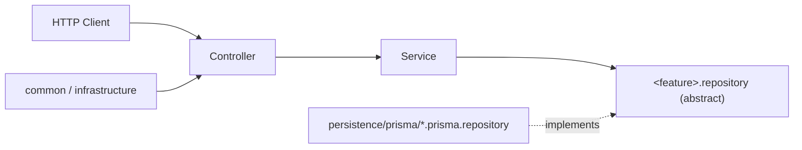

# Harbor API Kit

Production-oriented NestJS API starter built with NestJS (Fastify adapter). Follows Clean Architecture with strict layer boundaries, centralized configuration, and a security-first design (sessions, CSRF, rate limiting, authorization, file storage, i18n).

## Who This Is For

- Teams building a production-oriented NestJS API starter with strong module boundaries.
- Developers who want cookie-based auth, role-based authorization, Prisma, Redis, i18n, file storage, and contract tests wired together.
- Projects that value explicit architecture and guardrails over a minimal blank template.

## Who This Is Not For

- Tiny prototypes that need a single-file API.
- Projects that want JWT bearer-token auth as the default.
- Teams that do not want Clean Architecture boundaries enforced by lint rules.

## Why I Built This

I built Harbor API Kit to demonstrate how I structure production-oriented backend systems: strict module boundaries, session-based auth, authorization, i18n, file storage, testing, and deployment-ready Docker setup. The goal is not to be a complete SaaS product, but a reusable backend foundation that shows real-world engineering decisions.

## Tech Stack

| Category      | Technology                                            |
| ------------- | ----------------------------------------------------- |
| Runtime       | Node.js 22, TypeScript 5.9, NestJS 11, Fastify 5      |
| Database      | PostgreSQL (via Prisma 7)                             |
| Cache / Queue | Redis (ioredis), BullMQ                               |
| Auth          | better-auth (sessions, OAuth: Google/GitHub)          |
| Validation    | Zod v4 (strict DTOs)                                  |
| i18n          | nestjs-i18n (ar-SY, en-US)                            |
| Logging       | Pino (structured, request-scoped context)             |
| Email         | Resend (via BullMQ async queue)                       |
| File Storage  | S3-compatible, Local filesystem                       |
| API Docs      | Swagger (OpenAPI) + Scalar UI                         |
| Testing       | Jest + Supertest (unit, contract, e2e)                |
| CI            | GitHub Actions                                        |

## Implemented Features

- **Authentication** - Cookie-based sessions via better-auth, OAuth (Google, GitHub), email/password with optional verification emails, session management (list/revoke/logout-all), geolocation tracking (IP, city, country)
- **Authorization** - Static roles with permission inheritance, user-level ALLOW/DENY overrides, and effective-permission caching (L1 request-scoped + L2 Redis)
- **Users** - Identity CRUD, bans, impersonation and session revocation served by the Better Auth admin plugin under `/auth/admin/*`, permission-checked against the same effective-permission service
- **File Storage** - Multi-driver upload (S3/R2/Spaces, Local), magic bytes validation, presigned download URLs, public/private visibility toggle, public token-based access
- **Notifications** - Async email delivery via BullMQ + Resend, retry with exponential backoff, HTML email templates
- **Security** - CSRF double-submit cookies, rate limiting (global + per-route, IP/user/session strategies), application-level security headers, input validation (Zod strict mode), origin/referer allowlists
- **i18n** - Full internationalization (Arabic ar-SY default, English en-US), locale negotiation via header/query, translated error messages and email templates
- **API Documentation** - Auto-generated OpenAPI/Swagger at `/documentation` (Scalar UI), CSRF token injection for interactive testing
- **Health** - `GET /health` with database + Redis connectivity checks
- **Observability** - Pino structured logging with request ID, user ID, locale context injection

## Roadmap

Planned features live in [ROADMAP.md](ROADMAP.md). The README lists implemented behavior only.

## Known Limitations

- Email verification emails are sent, but verification enforcement is optional by default.
- The included production Docker Compose setup is a reference single-host deployment, not a full orchestration platform.
- The `shared` module is reserved for cross-feature provider wiring and currently only hosts shared cache binding.
- Security audit findings are triaged through Dependabot, CodeQL, and the advisory CI audit step; reachable production vulnerabilities should be fixed before release.

## Architecture

The layout is the **standard NestJS resource shape** — controller, service, DTOs, entities — plus **one addition**: a repository seam that keeps the database library replaceable.

See [ARCHITECTURE.md](ARCHITECTURE.md) for the full architectural rules (single source of truth).

### Feature module structure

```
modules/<feature>/
  <feature>.module.ts       # providers, controllers, exports
  <feature>.controller.ts   # HTTP only — guards, DTO, one service call
  <feature>.service.ts      # the behaviour
  <feature>.repository.ts   # abstract class = persistence port AND DI token
  <feature>.exception.ts
  dto/  entities/  guards/  decorators/
```

Flat by design: the role is in the file name, not in a folder. No `index.ts` barrels, no `*_TOKENS` symbol maps — abstract classes are the injection tokens.

### Dependency direction


```mermaid
flowchart LR
  Client[HTTP Client] --> Controller
  Controller --> Service
  Service --> Port["&lt;feature&gt;.repository (abstract)"]
  Adapter["persistence/prisma/*.prisma.repository"] -.implements.-> Port
  Common[common / infrastructure] --> Controller
```

A service depends on the **abstract** repository declared beside it; the Prisma implementation lives in `src/persistence/` and is bound there. Swapping Prisma means adding one folder and editing one file — see [docs/persistence.md](docs/persistence.md).

Four boundaries are ESLint-enforced and fail CI:

1. Prisma is confined to `src/persistence/**` — enforced from both sides.
2. Another module's repository is private; collaborate through its exported service.
3. Validation is Zod (`class-validator` is forbidden).
4. Redis clients belong to `src/infrastructure/cache/`.

## Documentation

Architecture is governed by the top-level architecture reference, with practical guides under [`docs/`](docs/README.md):

- [ARCHITECTURE.md](ARCHITECTURE.md) — authoritative architectural reference (layers, dependency direction, public API boundary, file-merging policy, anti-patterns).
- [docs/README.md](docs/README.md) — index of the practical guides.

| Guide                                                            | Purpose                                                                            |
| ---------------------------------------------------------------- | ---------------------------------------------------------------------------------- |
| [docs/adding-a-feature.md](docs/adding-a-feature.md)             | Step-by-step procedure for scaffolding a new feature or extending an existing one. |
| [docs/module-boundaries.md](docs/module-boundaries.md)           | Allowed and forbidden imports between modules and layers; public API rules.        |
| [docs/file-organization.md](docs/file-organization.md)           | When to merge files, when to split, naming conventions, size thresholds.           |
| [docs/persistence.md](docs/persistence.md)                       | The contract that keeps Prisma replaceable: repository ports, transactions, error mapping. |
| [docs/shared-core-extraction.md](docs/shared-core-extraction.md) | What belongs in `common/` / `infrastructure/` vs what stays feature-owned (the three-signal rule). |
| [docs/quickstart.md](docs/quickstart.md)                         | Short local setup path for first-time users.                                       |
| [docs/configuration.md](docs/configuration.md)                   | Environment variables and runtime configuration groups.                            |
| [docs/api-conventions.md](docs/api-conventions.md)               | Response envelope, auth cookies, CSRF, and validation conventions.                 |
| [docs/deployment.md](docs/deployment.md)                         | Production Docker Compose reference and deployment notes.                          |
| [docs/roadmap.md](docs/roadmap.md)                               | Implemented vs planned work, including deliberately incomplete areas.              |
| [docs/testing.md](docs/testing.md)                               | Unit, contract, and e2e expectations; test environment; troubleshooting.           |
| [docs/workflow-checklist.md](docs/workflow-checklist.md)         | Per-task checklists and the Definition of Done.                                    |

### Contributor / AI Agent Guardrails

[AGENTS.md](AGENTS.md) documents the operating rules contributors and AI agents must follow in this repository: module boundaries, naming, Definition of Done, and anti-bypass rules.

## Development Process

This project was built with AI-assisted pair programming for scaffolding, documentation, and repetitive implementation tasks. Architectural decisions, code review, integration, testing strategy, and final ownership were handled by me. The repository includes [AGENTS.md](AGENTS.md) to document the rules any AI agent or contributor must follow.

### Folder Structure

```
src/
  main.ts              # entrypoint
  bootstrap.ts         # createApp / configureApp — reused by the test factory
  app.module.ts
  config/              # registerAs factories + per-namespace Zod schemas
  common/              # cross-cutting code, no Nest module of its own
    cache/             # AppCacheService
    common.module.ts   # @Global() — AppCacheService, RequestContextStorePort
    constants/         # cache TTLs, locales, metadata keys
    context/           # request context store, type, Fastify hook
    decorators/        # @ResponseMessage, @SkipEnvelope, @ApiResponses
    docs/              # Swagger/Scalar setup
    exceptions/        # AppException, AppErrorCode, ERROR_DEFINITIONS
    filters/           # GlobalExceptionFilter
    interceptors/      # RequestIdentity, Response, AuthRedirect
    ports/             # CacheManagerPort, RateLimiterPort
    security/          # CSRF guard, rate limiting
    setup/             # CORS
    types/  utils/  validation/
  infrastructure/      # one folder per external-system capability, each complete
    cache/             # Redis client + CacheManagerPort + AppCacheService + TTLs
    rate-limit/        # port + Redis adapter + module + 3 interceptors + decorators
    i18n/              # nestjs-i18n setup + locale resolver + translate helpers
    logger/            # Pino setup
    queue/             # BullMQ setup
  persistence/         # THE DATABASE — nothing else goes here
    persistence.module.ts   # @Global() — binds every repository port to its adapter
    transaction.manager.ts  # abstract TransactionManager
    prisma/                 # PrismaService, adapters, error mapper
  modules/
    auth/            # Authentication (better-auth, OAuth, sessions)
    authorization/   # Static policy, effective permissions, guards, per-user overrides
    files/           # File upload/download (S3, Local)
    notify/          # Email notifications (BullMQ + Resend)
    health/          # Health checks
prisma/
  schema.prisma      # Database schema (9 models)
  migrations/        # Migration history
  create-admin.ts    # One-off admin creation CLI
locales/             # i18n translation files (ar-SY, en-US)
ops/                 # Nginx config, SSL certs
test/                # E2E/contract tests + helpers
```

## API Conventions

### Response Envelope

All responses are wrapped in a consistent envelope:

```jsonc
// Success
{ "success": true, "message": "Translated message", "data": { ... } }

// Error
{ "success": false, "message": "Translated error" }

// Validation error
{ "success": false, "message": "Validation failed", "errors": [{ "path": "email", "message": "validation.email.invalid" }] }
```

Request IDs are exposed through the configured request ID header, not in the JSON error body.

### Versioning

URI-based: `/api/v1/{endpoint}`

### Error Handling

- All exceptions extend `AppException` with i18n message keys
- Validation errors return structured field-level errors
- No stack traces in production responses

### Authentication

Authentication is cookie-based and uses Better Auth's native routes under `/api/v1/auth/*`. Sign-up/sign-in responses set HttpOnly session cookies through `Set-Cookie`; they do not return bearer tokens.

Email verification is optional in this starter: verification emails are sent, but better-auth is configured with `requireEmailVerification: false` so applications can choose when to enforce verification.

## Run Locally

### Prerequisites

- Node.js 22+
- Docker & Docker Compose (for PostgreSQL + Redis)

### 1. Install dependencies

```bash
npm install
```

### 2. Configure environment

```bash
cp .env.example .env
```

Edit `.env` with your values. Required: `DATABASE_URL`, `REDIS_URL`, `BETTER_AUTH_SECRET`, `BETTER_AUTH_URL`, `RESEND_API_KEY`, `RESEND_FROM_EMAIL`, `RESEND_FROM_NAME`.

The default `.env.example` uses `STORAGE_DRIVER=r2`. Fill the S3/R2 variables
before starting the app, or switch to `STORAGE_DRIVER=local` for quick
local-only testing.

### 3. Start infrastructure

```bash
docker compose -f docker-compose.dev.yml up -d
```

### 4. Database setup

```bash
npx prisma migrate dev
```

Roles and inherited permissions are static code in the authorization catalog, so no
authorization seed or bootstrap step is required.

Create a local admin user through the explicit one-off CLI when you need one:

```bash
npm run admin:create -- \
  --email admin@example.com \
  --name 'Admin User' \
  --locale ar-SY
```

The CLI asks for `Admin password:` and `Confirm password:` through hidden
prompts. The password must contain 12–128 characters.

The project does not create demo users or default-password accounts in
production.

### 5. Start dev server

```bash
npm run start:dev
```

The API will be available at `http://localhost:5000/api/v1/`.
API documentation at `http://localhost:5000/documentation` (requires `ENABLE_DOCS=true`).

## Scripts

| Script                    | Description                                   |
| ------------------------- | --------------------------------------------- |
| `npm run start:dev`       | Development mode (watch)                      |
| `npm run build`           | Production build                              |
| `npm run start:prod`      | Run compiled build                            |
| `npm run lint`            | ESLint with auto-fix                          |
| `npm run format`          | Prettier formatting                           |
| `npm run test`            | Unit tests                                    |
| `npm run test:e2e`        | E2E + contract tests (starts Docker services) |
| `npm run test:cov`        | Unit tests with coverage                      |
| `npm run prisma:generate` | Regenerate Prisma client                      |
| `npm run prisma:migrate`  | Create new migration                          |
| `npm run admin:create`    | Create the first admin through Better Auth    |
| `npm run prisma:studio`   | Open Prisma Studio                            |

## Security Automation

- Dependabot monitors npm and GitHub Actions dependencies.
- CodeQL runs on pushes, pull requests, and a weekly schedule.
- `npm audit --audit-level=high` runs in CI as an advisory, non-blocking check. It is intentionally non-blocking because advisories can appear in transitive development tooling; reachable production vulnerabilities should still be fixed or explicitly documented before release.

## Testing

- **Unit tests** (`src/**/*.spec.ts`): services (with the repository port overridden), value objects, validators, pure helpers
- **Contract tests** (`test/*.contract-spec.ts`): API contract validation (auth, authorization, user permissions, files, security)
- **E2E tests** (`test/*.e2e-spec.ts`): Full integration with database and Redis

### Test environment setup

Tests use a separate environment with PostgreSQL on port 5435 and Redis on port 6380.

```bash
# 1. Copy test environment template (if .env.test doesn't exist)
cp .env.test.example .env.test

# 2. Start test infrastructure
docker compose -f docker-compose.test.yml up -d

# 3. Run database migrations for test DB
npx prisma migrate deploy

# 4. Run unit tests (no Docker required)
npm run test

# 5. Run E2E/contract tests (requires Docker services)
npm run test:e2e
```

Note: `npm run test:e2e` automatically runs `test:e2e:prepare` which starts Docker services and runs migrations.

## Configuration

Runtime configuration is split into validated namespaces under `src/config/` and registered globally through `ConfigurationModule`. Consumers inject only the namespace they need; direct `process.env` reads outside `src/config/` are forbidden.

Key configuration namespaces: `app`, `auth`, `database`, `redis`, `http`, `storage`, `notification`, `logger`, `i18n`, and `tenant`.

See [.env.example](.env.example) and [docs/configuration.md](docs/configuration.md) for the full list of environment variables with descriptions.

## Production Deployment

See [docs/deployment.md](docs/deployment.md) for deployment details and production caveats.

```bash
docker compose -f docker-compose.prod.yml up -d
```

The production stack includes: PostgreSQL, Redis, API (multi-stage Docker build), and Nginx reverse proxy with SSL.

Note: `prisma` is included as a production dependency because database migrations run at container startup (`npx prisma migrate deploy`). For multi-replica deployments, consider running migrations in a separate init container.

## Admin Bootstrap

Production deployments run migrations first and then create the first admin
explicitly. Roles and permissions ship with the application code:

```bash
APP_ENV=production npm run admin:create -- \
  --email admin@example.com \
  --allow-production
```

Run `admin:create` from a source checkout or deployment
workspace with dev tooling installed. The production Docker image is optimized
for running the API and migrations, not for executing TypeScript CLI scripts.

See [docs/admin-bootstrap.md](docs/admin-bootstrap.md) for details.

## License

MIT - use it, fork it, learn from it, and adapt it to your own projects.
